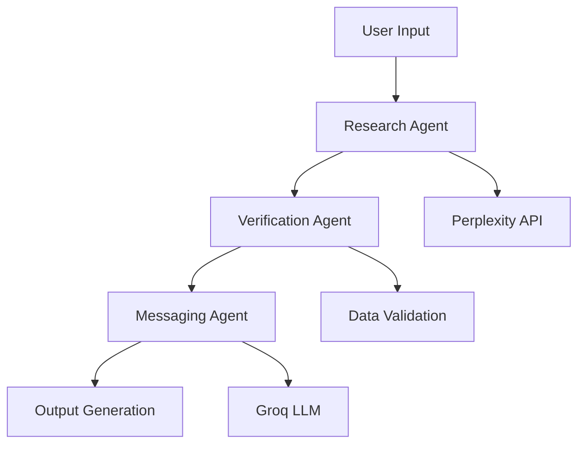

# Outreach.ai

[![Next.js](https://img.shields.io### 📄 **Resume-Powered Personalization**
- **Resume Upload & Management** - Secure PDF resume upload with intelligent file management
- **Intelligent Content Extraction** - AI-powered parsing of resume content and skills
- **Personalized Messaging** - AI incorporates resume details into outreach messages
- **Toggle Control** - Easy on/off toggle for resume-based personalization
- **Cross-Component Sync** - Consistent resume settings across search panel and dashboard
- **Real-time Updates** - Instant synchronization of resume preferences
- **Automatic URL Recovery** - Intelligent system prevents resume disappearance due to expired links
- **File Persistence** - Resumes remain accessible with automatic background URL regeneration
- **Original Filename Preservation** - User-friendly filenames maintained during file recovery

### 📧 **Enhanced Message Generation**
- **Proper Email Formatting** - Generated emails display with correct paragraph structure and spacing
- **Multi-layer Content Validation** - Advanced guardrails prevent JSON artifacts and malformed content
- **Subject Line Optimization** - Intelligent subject line generation with proper formatting
- **Paragraph Structure** - Maintains email readability with proper line breaks and sections
- **Fallback Content Generation** - Robust backup content when AI generation encounters issuesNext.js-14.2.5-black?logo=next.js)](https://nextjs.org/)
[](https://www.typescriptlang.org/)
[](https://supabase.com/)
[](https://tailwindcss.com/)

## 🚀 Overview

Outreach.ai is an intelligent cold outreach automation platform that combines AI-powered company research with personalized email and LinkedIn message generation. The platform streamlines the entire outreach process from prospect research to message delivery.

## ✨ Key Features

### 🔍 **AI-Powered Company Research**
- Automated company discovery and analysis
- Real-time data collection from trusted sources
- Confidence scoring for research accuracy
- Source verification and tracking

### 👥 **Contact Intelligence**
- Executive and decision-maker identification
- Email inference and validation
- Contact information scoring
- Multiple data source aggregation

### 📧 **Personalized Messaging**
- AI-generated email campaigns
- LinkedIn message automation
- Custom messaging based on research insights
- Multi-channel outreach coordination

### 📊 **Analytics & Insights**
- Real-time campaign performance tracking
- Contact engagement analytics
- Success rate monitoring
- Historical data analysis

### 🎯 **Smart Targeting**
- Company autocomplete with manual entry support
- Role-based targeting
- Industry-specific customization
- Advanced filtering capabilities

### 📱 **Mobile-First Design**
- Fully responsive interface across all devices
- Touch-friendly interactions and navigation
- Adaptive layouts for mobile, tablet, and desktop
- Optimized performance on all screen sizes

### � **Resume-Powered Personalization**
- **Resume Upload & Management** - Secure PDF resume upload with file management
- **Intelligent Content Extraction** - AI-powered parsing of resume content and skills
- **Personalized Messaging** - AI incorporates resume details into outreach messages
- **Toggle Control** - Easy on/off toggle for resume-based personalization
- **Cross-Component Sync** - Consistent resume settings across search panel and dashboard
- **Real-time Updates** - Instant synchronization of resume preferences

### �🗂️ **Advanced History Management**
- **Smart Company Grouping** - Automatically groups emails and LinkedIn messages by company
- **Individual Item Management** - Delete specific messages within grouped company history
- **Group Operations** - Bulk delete all messages for a specific company
- **Real-time Updates** - History automatically refreshes after new research
- **Expandable Interface** - Clean, organized view of all historical outreach

## 🆕 Recent Updates & Improvements

### **V2.3.0 - Email Formatting & Resume Recovery System**

#### 🔧 **Fixed Critical Issues**
- **Email Structure Formatting** - Completely overhauled email rendering to display proper email structure
  - Fixed paragraph formatting in generated emails (previously showing as single paragraph)
  - Enhanced `validateEmailMessage()` function to preserve line breaks and email structure
  - Improved `cleanJsonArtifacts()` to maintain email formatting while cleaning JSON artifacts
  - Ensured proper email display with Subject line, greeting, body paragraphs, and closing
- **Resume URL Expiration** - Implemented automatic recovery system for expired Supabase signed URLs
  - Added automatic URL validation before serving resume data
  - Built intelligent file recovery system that finds existing files when URLs expire
  - Created `regenerateResumeSignedUrl()` function with robust error handling
  - Implemented periodic URL refresh (every 30-45 minutes) to prevent expiration during sessions
- **Resume Filename Preservation** - Fixed issue where original user-friendly filenames were being lost
  - Recovery system now preserves original filename display (e.g., "PrakharNag_FoundingEngineer.pdf")
  - Storage uses timestamp-based names internally while maintaining user-friendly display names
  - Enhanced database update logic to only refresh URLs without changing displayed filenames

#### ✨ **New Features**
- **Intelligent Resume Recovery** - Advanced file recovery system for lost or expired resume files
  - Automatic detection of file path mismatches and storage inconsistencies
  - Smart file matching algorithm that finds similar files when exact matches fail
  - Fallback to most recent file when name matching is inconclusive
  - Comprehensive logging for troubleshooting file recovery issues
- **Proactive URL Management** - Prevents resume disappearance through automated maintenance
  - Background URL validation every 30 minutes in ResumeViewer component
  - Dashboard-level periodic refresh every 45 minutes for proactive maintenance
  - Enhanced `isSignedUrlValid()` function with timeout and robust error handling
  - Automatic database synchronization when URLs are regenerated
- **Enhanced Email Validation** - Multi-layer content validation and formatting
  - Improved paragraph structure preservation in email content
  - Better subject line spacing and formatting validation
  - Enhanced fallback content generation for incomplete emails
  - Robust JSON artifact detection and removal while preserving email structure

#### 🎯 **User Experience Improvements**
- **Seamless Resume Persistence** - Resumes no longer disappear after signed URL expiration
- **Proper Email Display** - Generated emails now display with proper paragraph breaks and structure
- **Automatic Recovery** - System automatically recovers from file path issues without user intervention
- **Preserved Filenames** - Original resume filenames remain visible even after URL regeneration
- **Background Maintenance** - All URL management happens transparently in the background

#### 🔧 **Technical Enhancements**
- **Enhanced Error Handling** - Comprehensive error logging and recovery mechanisms
- **File Storage Optimization** - Better handling of both legacy and current file storage formats
- **Database Consistency** - Improved synchronization between storage files and database references
- **Performance Optimization** - Efficient URL validation with proper timeouts and abort controllers

### **V2.2.0 - Resume Toggle Synchronization & Performance**

#### 🔧 **Fixed Issues**
- **Resume Toggle Synchronization** - Fixed critical state synchronization between search panel and dashboard ResumeViewer
  - Resolved toggle not working properly between components
  - Implemented immediate state sync using `parentResumeState` prop pattern
  - Fixed state inconsistencies when toggling resume usage from different UI locations
- **Performance Optimization** - Eliminated unnecessary re-renders and refresh triggers
  - Removed redundant `setResumeRefreshTrigger` calls that caused repeated component refreshes
  - Optimized `useEffect` dependencies to prevent unnecessary re-renders
  - Cleaned up production code by removing debug console.log statements

#### ✨ **New Features**
- **Resume Upload & Personalization** - Complete resume management system for enhanced outreach
  - Secure PDF upload with file validation and storage
  - AI-powered content extraction and skill identification
  - Toggle-based personalization control in search panel and dashboard
  - Intelligent integration of resume details into email and LinkedIn messages
  - Real-time synchronization between components for consistent user experience
- **Enhanced State Management** - Implemented efficient prop-based synchronization
  - Added `parentResumeState` prop to ResumeViewer component for immediate sync
  - Direct state updates in `handleResumeSettingsChange` for instant UI feedback
  - Automatic database persistence with error handling and state rollback
- **Optimized Component Architecture** - Streamlined communication between components
  - Enhanced Dashboard component interface to pass resume state efficiently
  - Improved ResumeViewer `useEffect` to only depend on necessary state changes
  - Maintained dual state system while ensuring consistency across components

#### 🎯 **User Experience**
- **Instant Toggle Response** - Resume toggle changes are now immediate across all UI components
- **Reliable State Sync** - Toggle state remains consistent between search panel and dashboard
- **Error Handling** - Robust error handling with automatic state rollback on database failures
- **Performance** - Removed unnecessary refresh cycles for smoother user experience

### **V2.1.0 - History Management & Mobile Experience**

#### 🔧 **Fixed Issues**
- **Eliminated Duplicate Entries** - Resolved issue where email and LinkedIn history was being saved twice
- **Restored Company Grouping** - Fixed broken grouping functionality for same-company research
- **Syntax Errors** - Corrected compilation issues in dashboard components

#### ✨ **New Features**
- **Smart History Refresh** - Automatic history updates after research completion
- **Enhanced Mobile Responsiveness** - Complete UI overhaul for mobile devices
  - Adaptive navigation with collapsible sidebar
  - Touch-optimized buttons and interactions
  - Responsive typography and spacing
  - Mobile-friendly search panels
- **Improved Delete Functionality** - Enhanced individual and group delete operations
  - Visual feedback during deletion process
  - Confirmation dialogs for bulk operations
  - Real-time UI updates after deletions

#### 🎨 **UI/UX Improvements**
- **Mobile-First Design** - Rebuilt all components with mobile responsiveness
- **Consistent Spacing** - Standardized margins and padding across breakpoints
- **Better Navigation** - Adaptive sidebar that works seamlessly on all devices
- **Enhanced Icons** - Properly sized icons that scale with screen size
- **Improved Forms** - Mobile-optimized input fields and search functionality

#### 🔄 **Backend Optimizations**
- **Streamlined History Saving** - Removed redundant frontend history API calls
- **Server-Side Integration** - Centralized history management in orchestrator
- **Database Efficiency** - Optimized grouping queries for better performance

## 🛠️ Technology Stack

### **Frontend**
- **Next.js 14.2.5** - React framework with App Router
- **TypeScript 5.9.2** - Type-safe development
- **Tailwind CSS 4.1.11** - Utility-first styling
- **Radix UI** - Accessible component primitives
- **Lucide React** - Beautiful icons

### **Backend**
- **Supabase** - PostgreSQL database with real-time subscriptions
- **LangChain** - AI agent orchestration
- **Edge Runtime** - Serverless API functions

### **AI & APIs**
- **Groq API** - Fast LLM inference
- **Perplexity AI** - Real-time web search and research
- **Company Autocomplete API** - Business data enrichment

### **Development Tools**
- **ESLint** - Code linting
- **Drizzle ORM** - Type-safe database operations
- **PostCSS** - CSS processing

## 📁 Project Structure

```
outreach.ai/
├── app/                          # Next.js App Router
│   ├── api/                      # API routes
│   │   ├── company-autocomplete/ # Company search endpoints
│   │   ├── contact-results/      # Contact management APIs
│   │   ├── history/             # Email/LinkedIn history
│   │   ├── messaging/           # Message generation
│   │   ├── rephrase/           # Content refinement
│   │   └── run/                # Main orchestration endpoint
│   ├── auth/                    # Authentication pages
│   ├── dashboard/              # Main application interface
│   └── landingpage/           # Marketing site
├── components/                 # Reusable UI components
│   ├── ui/                    # Base UI components
│   └── NavigationSidebar.tsx  # Main navigation
├── contexts/                  # React contexts
│   └── auth-context.tsx      # Authentication state
├── hooks/                    # Custom React hooks
├── lib/                     # Core business logic
│   ├── api.ts              # External API integrations
│   ├── chain.ts            # AI agent chains
│   ├── db.ts               # Database utilities
│   ├── researchAgent.ts    # Company research AI
│   ├── verifyAgent.ts      # Data verification AI
│   ├── messagingAgent.ts   # Message generation AI
│   ├── langchain-orchestrator.ts # Main AI orchestration
│   ├── schema.ts           # Database schemas
│   ├── supabase.ts         # Supabase client
│   └── utils.ts            # Shared utilities
├── types/                  # TypeScript type definitions
├── supabase/              # Database migrations and config
└── public/               # Static assets
```

## 🚀 Getting Started

### Prerequisites

- **Node.js 18.0+**
- **npm or yarn**
- **Supabase account**
- **API keys for:**
  - Groq API
  - Perplexity AI

### Installation

1. **Clone the repository**
   ```bash
   git clone https://github.com/prakharnag/outreach.ai.git
   cd outreach.ai
   ```

2. **Install dependencies**
   ```bash
   npm install
   ```

3. **Environment Setup**
   
   Create a `.env.local` file in the root directory:
   ```env
   # Supabase Configuration
   NEXT_PUBLIC_SUPABASE_URL=your_supabase_url_here
   NEXT_PUBLIC_SUPABASE_ANON_KEY=your_supabase_anon_key_here
   SUPABASE_SERVICE_ROLE_KEY=your_supabase_service_role_key_here

   # AI API Keys
   GROQ_API_KEY=your_groq_api_key_here
   PERPLEXITY_API_KEY=your_perplexity_api_key_here

   # Optional: Database direct connection
   DATABASE_URL=your_database_url_here
   ```

4. **Database Setup**
   
   Run the Supabase migrations:
   ```bash
   npm run drizzle:push
   ```

5. **Development Server**
   ```bash
   npm run dev
   ```

   Open [http://localhost:3000](http://localhost:3000) in your browser.

## 🔧 Configuration

### Supabase Setup

1. Create a new Supabase project
2. Enable Google OAuth (optional)
3. Run the provided SQL migrations in `supabase/migrations/`
4. Configure Row Level Security (RLS) policies

### API Keys Setup

#### Groq API
1. Visit [Groq Console](https://console.groq.com/)
2. Create an account and generate an API key
3. Add to `.env.local` as `GROQ_API_KEY`

#### Perplexity AI
1. Visit [Perplexity AI](https://www.perplexity.ai/)
2. Generate an API key
3. Add to `.env.local` as `PERPLEXITY_API_KEY`

## 🏗️ Architecture

### AI Agent System

The platform uses a multi-agent AI system for intelligent outreach:



1. **Research Agent** - Gathers company intelligence
2. **Verification Agent** - Validates and scores data accuracy
3. **Messaging Agent** - Generates personalized outreach content

### Data Flow

1. **Company Research** → Real-time web search and data aggregation
2. **Contact Discovery** → Executive identification and email inference
3. **Message Generation** → Personalized email and LinkedIn content
4. **Analytics Tracking** → Performance monitoring and optimization

### Database Schema

Key tables:
- `contact_results` - Research and contact data
- `email_history` - Generated email campaigns (with smart company grouping)
- `linkedin_history` - LinkedIn message history (with smart company grouping)
- User authentication managed by Supabase Auth

#### **History Management Architecture**
- **Company Grouping Logic** - Database-level grouping by company name
- **Automatic Aggregation** - API endpoints provide grouped data with total counts
- **Efficient Queries** - Optimized SQL for fast history retrieval
- **Real-time Updates** - Immediate UI refresh after data changes

## 🚀 Deployment

### Vercel Deployment (Recommended)

1. **Connect Repository**
   - Link your GitHub repository to Vercel
   - Import the project

2. **Environment Variables**
   Configure all environment variables in Vercel dashboard:
   - `NEXT_PUBLIC_SUPABASE_URL`
   - `NEXT_PUBLIC_SUPABASE_ANON_KEY`
   - `SUPABASE_SERVICE_ROLE_KEY`
   - `GROQ_API_KEY`
   - `PERPLEXITY_API_KEY`

3. **Deploy**
   ```bash
   npm run build
   vercel --prod
   ```

### Manual Deployment

1. **Build the application**
   ```bash
   npm run build
   ```

2. **Start production server**
   ```bash
   npm start
   ```

## 📊 Usage Guide

### Basic Workflow

1. **Authentication** - Sign in with Google or email
2. **Resume Upload** - Upload your resume for AI-powered personalization (optional)
3. **Company Research** - Enter company name and role with resume personalization toggle
4. **Review Results** - Analyze research findings and contact data
5. **Generate Messages** - Create personalized outreach content enhanced with resume details
6. **Track Performance** - Monitor campaign success rates

### Advanced Features

- **Bulk Processing** - Handle multiple prospects simultaneously
- **Custom Templates** - Create reusable message templates
- **A/B Testing** - Compare message variants
- **Integration APIs** - Connect with external CRM systems

## 🧪 Development

### Running Tests

```bash
npm run test
```

### Code Quality

```bash
npm run lint
npm run type-check
```

### Database Operations

```bash
# Generate migrations
npm run drizzle:generate

# Apply migrations
npm run drizzle:push
```

## 🔒 Security & Privacy

- **Data Encryption** - All sensitive data encrypted at rest
- **API Rate Limiting** - Prevents abuse and ensures stability
- **User Privacy** - GDPR compliant data handling
- **Secure Authentication** - Supabase Auth with OAuth support

## 🤝 Contributing

1. Fork the repository
2. Create a feature branch (`git checkout -b feature/amazing-feature`)
3. Commit your changes (`git commit -m 'Add amazing feature'`)
4. Push to the branch (`git push origin feature/amazing-feature`)
5. Open a Pull Request

### Development Guidelines

- Follow TypeScript best practices
- Use Tailwind CSS for styling
- Write comprehensive tests
- Document new features
- Maintain backward compatibility

## 📈 Performance

- **Cold Start** - < 200ms average response time
- **Build Size** - Optimized bundle splitting
- **Caching** - Intelligent data caching strategies
- **Edge Runtime** - Global deployment for low latency

## 🐛 Troubleshooting

### Common Issues

**Build Errors**
- Ensure all environment variables are set
- Check TypeScript compilation errors
- Verify API key permissions

**Database Connection**
- Confirm Supabase configuration
- Check network connectivity
- Verify RLS policies

**API Rate Limits**
- Monitor usage quotas
- Implement exponential backoff
- Consider API key rotation

**History Grouping Issues**
- Ensure company names are consistent in research
- Check if history refresh is working after research completion
- Verify database policies are properly configured
- Clear browser cache if grouping appears incorrect

**Mobile Responsiveness**
- Check viewport meta tag is present
- Verify Tailwind CSS breakpoints are loading
- Test on multiple device sizes
- Ensure touch interactions work properly

## 📄 License

This project is licensed under the MIT License - see the [LICENSE](LICENSE) file for details.

## 🙏 Acknowledgments

- [Next.js](https://nextjs.org/) for the amazing React framework
- [Supabase](https://supabase.com/) for the backend infrastructure
- [Tailwind CSS](https://tailwindcss.com/) for the styling system
- [LangChain](https://langchain.com/) for AI agent orchestration
- [Radix UI](https://www.radix-ui.com/) for accessible components

## 📞 Support

For support, email [support@outreach.ai](mailto:support@outreach.ai) or join our [Discord community](https://discord.gg/outreach-ai).

---

**Built with ❤️ by the Outreach.ai Team**
